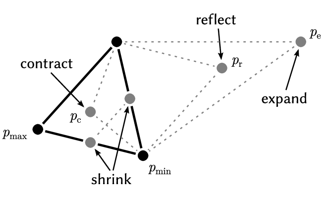

# 1. Tétel

Az optimalizálás alapjai (direkt kereső módszerek, gradiens alapú módszerek Karush-Kuhn-Tucker feltételek, dinamikus programozás/Pontrjagin elv)

---

## Analitikus optimalizálás

### Korlátozások nélküli eset:

- Egyváltozós függvény szélsőértéke:
    - Szükséges feltétel: az első derivált nulla (stacionárius pont)
    - Elégséges feltétel: páros számú magasabb derivált nem nulla (pl. a 2. derivált). Ha pozitív: minimum, ha negatív: maximum.

- Többváltozós függvény szélsőértéke:
    - Szükséges feltétel: minden első derivált nulla (stacionárius pont): 
      ```math
      \frac{\partial f}{\partial x_i}=0, \quad i=1\dots n
      ```

    - Elégséges feltétel: A második deriváltakból alkotott szimmetrikus mátrix (Hesse-mátrix) pozitív vagy negatív definit:

        - Pozitív definit (minden sajátértéke pozitív) $`\rightarrow`$ minimum
        - Negatív definit (minden sajátértéke negatív) $`\rightarrow`$ maximum

### Többváltozós függvény szélsőértéke _egyenlőség típusú_ korlátozások mellett:

Optimalizálandó függvény: $`f(\mathbf{x})`$, ahol $`\mathbf{x}=[x_1,\dots,x_n]^T`$ 
Korlátozások: $`\mathbf{g}(\mathbf{x})=[g_1(\mathbf{x}),\dots,g_r(\mathbf{x})]^T=\mathbf{0}`$

_Lagrange-multiplikátor szabály_:  
Vezessük be az 
```math
L(\mathbf{x},\lambda) = f(\mathbf{x})+\lambda^T \mathbf{g}(\mathbf{x})
```
Lagrange-függvényt, ahol $`\lambda = [\lambda_1,\dots,\lambda_r]^T`$ a Lagrage-multiplikátor. Ez a függvény tartalmazza az eredeti célfüggvényt és a korlátozásokat is. Egy adott $`\mathbf{x}`$ pontban a szélsőérték létezésének szükséges feltétele, hogy $`\nabla L(\mathbf{x},\lambda)=\mathbf{0}`$, azaz a Lagrange-függvény minden változó szerinti első deriváltja nulla. Részletesebben:
```math
\nabla f(\mathbf{x}) + \sum_{i=1}^r \lambda_i \nabla g_i(\mathbf{x}) = \mathbf{0}, \quad \text{(}x_1,\dots,x_n\text{ szerinti deriváltak)}
```
```math
g_1(\mathbf{x})=\cdots=g_r(\mathbf{x})=0, \quad \text{(}\lambda_1,\dots,\lambda_r\text{ szerinti deriváltak)}
```

A második egyenlet magukat a korlátozásokat jelenti, ezek határozzák meg az $`\mathbf{x}`$ pontok megengedett halmazát. Az első egyenlet jelentése átrendezés után szemléletesen megadható:
```math
\nabla f(\mathbf{x}) = -\sum_{i=1}^r \lambda_i \nabla g_i(\mathbf{x}),
```
azaz a célfüggvény gradiense kifejezhető a korlátozásokat definiáló $`g_i(\mathbf{x})`$ függvények gradienseinek lineáris kombinációjaként. A $`g_i(\mathbf{x})=0`$ korlátozás ugyanis nem más, mint a $`g_i(\mathbf{x})`$ függvény egy $`n-1`$ dimenziós kontúrfelülete, amely bármely pontjában ortogonális a $`g_i`$ függvény ottani gradiensére. Az összes korlátozást teljesítő pontok halmaza egy $`n-r`$ dimenziós felület, amely bármely pontjában ortogonális az összes $`\nabla g_i`$ gradiensre, így ezek bármilyen lineáris kombinációjára is. Ha a célfüggvény $`\nabla f(\mathbf{x})`$ gradiense kifejezhető a korlátozások gradienseinek lineáris kombinációjaként, az azt jelenti, hogy $`\nabla f(\mathbf{x})`$ is ortogonális a korlátozások által definiált kontúrfelületre, azaz a vizsgált pont $`f(\mathbf{x})`$-nek stacionárius pontja (a korlátozások figyelembe vételével).


### Többváltozós függvény szélsőértéke _egyenlőtlenség típusú_ korlátozások mellett:

Optimalizálandó függvény:  
- $`f(\mathbf{x})``$, ahol $`\mathbf{x}=[x_1,\dots,x_n]^T`$  

Korlátozások: 
- $`\mathbf{g}(\mathbf{x})=[g_1(\mathbf{x}),\dots,g_r(\mathbf{x})]^T = \mathbf{0}`$ (egyenlőség típusú)
- $`\mathbf{h}(\mathbf{x})=[h_1(\mathbf{x}),\dots,h_s(\mathbf{x})]^T \leq \mathbf{0}`$ (egyenlőtlenség típusú)

Az optimum szükséges feltételeit ebben az esetben a _Karush-Kuhn-Tucker feltételek_ adják meg, amelyek a Lagrange-multiplikátor szabály általánosításának tekinthetők. A feltételeket minimalizálási feladat esetére adjuk meg. A korlátozásokat itt is egy Lagrange-függvény segítségével vesszük figyelembe:
```math
L(\mathbf{x},\lambda,\mu) = f(\mathbf{x}) + \lambda^T \mathbf{g}(\mathbf{x}) + \mu^T \mathbf{h}(\mathbf{x})
```
ahol $`\lambda = [\lambda_1,\dots,\lambda_r]^T`$ az egyenlőség típusú, $`\mu = [\mu_1,\dots,\mu_s]^T`$ az egyenlőtlenség típusú korlátozásokhoz tartozó KKT-multiplikátorok. Az $`\mathbf{x}`$ elemeit primer változóknak, $`\lambda`$ és $`\mu`$ elemeit duális változóknak is nevezik.

Ha $`(\mathbf{x}^*,\lambda^*,\mu^*)`$ egy optimumponthoz tartozó primer és duális változók, akkor a következő feltételek teljesülnek (az optimum szükséges feltételei, KKT feltételek): 

1. Primer változó megfelelősége (Primal feasibility), vagyis $`\mathbf{x}^*`$ teljesíti a korlátozásokat:
```math
\nabla_{\lambda}L(\mathbf{x}^*,\lambda^*,\mu^*) = \mathbf{g}(\mathbf{x}^*) = \mathbf{0}
```
```math
\nabla_{\mu}L(\mathbf{x}^*,\lambda^*,\mu^*) = \mathbf{h}(\mathbf{x}^*) \leq \mathbf{0}
```

2. Stacionaritás (Stationarity), azaz a korlátozások által megengedett irányokban nem lehetséges $`f`$ csökkentése:
```math
\nabla_{\mathbf{x}}L(\mathbf{x}^*,\lambda^*,\mu^*) = \nabla f(\mathbf{x}^*) + \sum_{i=1}^r \lambda_i^* \nabla g_i(\mathbf{x}^*) + \sum_{j=1}^s \mu_j^* \nabla h_j(\mathbf{x}^*) = \mathbf{0}
```

3. Komplementaritás (Complementarity). Az egyenlőtlenség típusú korlátozásokat definiáló függvények és a hozzájuk tartozó Lagrange-multiplikátorok szorzata az optimumpontban zérus:
```math
\mu_j^* h_j(\mathbf{x}^*) = 0, \quad j=1\dots s
```

4. Duális változó megfelelősége (Dual feasibility):
```math
\mu_j^* \geq 0, \quad j=1\dots s
```

Az első két feltétel megegyezik a Langrange-multiplikátor szabálynál látottakkal. A harmadik és a negyedik feltétel plusz elvárásokat fogalmaz meg az egyenlőtlenség típusú korlátozásokat definiáló függvényekhez tartozó multiplikátorokkal szemben. Ha az optimumpont a korlátozott tartomány belsejében van (vagyis $`h_j(\mathbf{x}^*)<0`$), tehát a korlátozás nem aktív, akkor a feltételeknek megfelelően $`\mu_j^*=0`$. Ebben az esetben ez a korlátozás mintegy "törlődik" a Lagrange-függvényből. Ha viszont az optimumpont a tartomány peremén van (azaz $`h_j(\mathbf{x}^*)=0`$), akkor $`\mu_j^*>0`$, és a korlátozás az egyenlőség típusúakhoz hasonlóan viselkedik. Vagyis a stacionaritási feltétel miatt az optimumpontban a célfüggvény gradiense kifejezhető az egyenlőség típusú (vagy akként viselkedő) korlátozásokat definiáló függvények gradienseinek lineáris kombinációjaként, azaz a korlátozások irányában (a gradiensre merőlegesen) nem csökkenthető $`f`$ értéke.

A Lagrange-függvény segítséségével az eredeti (primer) problémát egy duális problémává alakítottuk, ahol a cél $`L(\mathbf{x},\lambda,\mu)`$ minimalizálása $`\mathbf{x}`$ szerint. Itt a $`\lambda_i`$ és $`\mu_j`$ multiplikátorok büntetőfaktorokként viselkednek, amelyeknek a hatása csak akkor érvényesül, ha a korlátozásokat megsértjük. A $`\mu_j`$ multiplikátorok értéke szükségképpen nemnegatív, mert csak így teljesül, hogy ha a hozzájuk tartozó korlátozások sérülnek, azaz $`h_j(\mathbf{x})>0`$, akkor a büntető költség pozitív. A $`\lambda_i`$ multiplikátorokra nincs ilyen megkötés, mert az egyenlőség típusú korlátozások megsértésének minősül $`g_i(\mathbf{x})>0`$ és $`g_i(\mathbf{x})<0`$ is. Az első esetben pozitív, a másodikban negatív $`\lambda_i`$ értékkel hozhatunk létre pozitív büntető költséget. 

Források:  
https://apmonitor.com/me575/index.php/Main/KuhnTucker  
https://youtu.be/uh1Dk68cfWs?si=ke9RX5RPilG475s0


### Dinamikus programozás, Pontrjagin-féle minimum-elv

Adott a következő diszktéridejű dinamikus rendszer:

```math
\mathbf{x}_{k+1} = \mathbf{f}_k(\mathbf{x}_k, \mathbf{u}_k)
```

Adott a következő minimalizálandó költségfüggvény:

```math
\min_{\mathbf{u}_1, \dots, \mathbf{u}_N} V=\sum_{k=1}^N H_k(\mathbf{x}_k, \mathbf{u}_k)
```

Ismert $`\mathbf{x}_1`$ kezdőállapot esetén keressük azt az optimális $`\mathbf{u}_1,\dots,\mathbf{u}_N`$ irányítást, amely minimális költséget eredményez. Az egyenlőség típusú korlátozásokat a rendszeregyenlet adja meg minden időpillanatra. A feladat megoldható dinamikus programozással (rekurzióval), amelynek alapja a minimumfeladat alábbi ekvivalens felírása:

```math
 \min_{\mathbf{u}_1, \dots, \mathbf{u}_N} \sum_{k=1}^N H_k(\mathbf{x}_k, \mathbf{u}_k) = 
\min_{\mathbf{u}_1} \min_{\mathbf{u}_2} \dots \min_{\mathbf{u}_N} \sum_{k=1}^N H_k(\mathbf{x}_k, \mathbf{u}_k) = \\
= \min_{\mathbf{u}_1} \Biggl( H_1 + \min_{\mathbf{u}_2} \biggl( H_2 + \dots + \min_{\mathbf{u}_{N}-1} \Bigl( H_{N-1} + \min_{\mathbf{u}_N} H_N \Bigr) \biggr) \Biggr)
```

Alternatív megoldásként alkalmazhatjuk a Lagrange-multiplikátor szabályt, amely a Pontrjagin-féle minimum-elv diszkrét változatának felel meg. Ehhez vezessük be a $`\lambda_k`$ Lagrange-multiplikátorokat, és írjuk fel a Lagrange függvényt:

```math
 L = \sum_{k=1}^N H_k(\mathbf{x}_k, \mathbf{u}_k) + \sum_{k=1}^{N-1} \Bigl( \mathbf{f}_k(\mathbf{x}_k, \mathbf{u}_k) - \mathbf{x}_{k+1} \Bigr)^T \lambda_k 
```

A Lagrange-függvény minimumának szükséges feltétele, hogy a gradiense zérus legyen:

```math
 \frac{\partial L}{\partial \mathbf{x}_k} = \frac{\partial H_k}{\partial \mathbf{x}_k} + \frac{\partial \mathbf{f}_k^T}{\partial \mathbf{x}_k}\lambda_k - \lambda_{k-1} = \mathbf{0} 
```
```math
 \frac{\partial L}{\partial \mathbf{u}_k} = \frac{\partial H_k}{\partial \mathbf{u}_k} + \frac{\partial \mathbf{f}_k^T}{\partial \mathbf{u}_k}\lambda_k = \mathbf{0}
```
```math
 \frac{\partial L}{\partial \lambda_k} = \mathbf{f}_k(\mathbf{x}_k, \mathbf{u}_k) - \mathbf{x}_{k+1} = \mathbf{0}
```

Bevezetve a $`h_k = H_k + \mathbf{f}_k^T\lambda_k`$ Hamilton-függvényt, a Lagrange-függvény a következő alakot ölti:

```math
 L = H_N(\mathbf{x}_N, \mathbf{u}_N) +\sum_{k=1}^{N-1} h_k(\mathbf{x}_k, \mathbf{u}_k, \lambda_k) - \sum_{k=1}^{N-1} \mathbf{x}_{k+1}^T \lambda_k 
```

A minimum szükséges feltételei pedig az alábbi alakban írhatók:

```math
\frac{\partial h_k}{\partial \mathbf{x}_k} = \lambda_{k-1}, \quad k = 2,\dots,N
```
```math
\frac{\partial h_k}{\partial \mathbf{u}_k} = \mathbf{0}, \quad k = 1,\dots,N-1
```
```math
\frac{\partial h_k}{\partial \lambda_k} = \mathbf{x}_{k+1}, \quad k = 1,\dots,N-1
```

Ez $`3(N-1)`$ darab egyenlet ugyanennyi ismeretlenre (tegyük fel, hogy $`\mathbf{u}_n=0`$, mivel $`\mathbf{x}_N`$ az utolsó állapot). Lineáris rendszer és kvardatikus költségfüggvény esetén lineáris egyenletrendszert kapunk.


Forrás:  
https://www.math.kth.se/optsyst/grundutbildning/5B1872/Discrete.pdf


## Numerikus optimalizálás

### Direkt kereső módszerek

Abban az esetben alkalmazhatók, ha csak a célfüggvény értéke ismert, a derivált nem (vagy a derivált nem számítható könnyen, ill. megbízhatóan).

#### Nelder-Mead módszer (downhill simplex method)

 Amódszer egy $`n`$-dimenziós függvény minimumát keresi meg egy $`n`$-dimenziós szimplex ($`n+1`$ csúcsponttal rendelkező konvex alakzat) iteratív deformációja segítségével. A szimplexet mindig $`n+1`$ pont határozza meg (két dimenzióban háromszög, három dimenzióban tetraéder és így tovább). Minden iterációban a csúcspontokban kiértékeljük a függvényt, és a legnagyobb függvényértékű pontot mozgatjuk a következő algoritmus szerint:
 
 1. Rendezzük sorba a pontokhoz tartozó függvényértékeket: $`f(\mathbf{x}_1) \leq f(\mathbf{x}_2) \leq f(\mathbf{x}_n) \leq f(\mathbf{x}_{n+1})`$
 2. Számítsuk ki az $`\mathbf{x}_1,\dots,\mathbf{x}_n`$ pontok súlypontját, ez legyen $`\mathbf{x}_o`$
 3. __Tükrözés (reflection)__:
    - Tükrözzük a legnagyobb függvényértékű $`\mathbf{x}_{n+1}`$ pontot a súlypontra, a tükrözött pont legyen $`\mathbf{x}_{r}`$.
    - Ha $`f(\mathbf{x}_{1}) \leq f(\mathbf{x}_{r}) \leq f(\mathbf{x}_{n})`$, vagyis a tükrözött pont függvényértéke a nem jobb, mint az eddigi legkisebb, de nem is rosszabb, mint az eddigi második legnagyobb, akkor a korábbi legrosszabb $`\mathbf{x}_{n+1}`$ pontot kicseréljük $`\mathbf{x}_{r}`$-re, és folytatjuk az 1. lépéssel.
4. __Nyújtás (expansion)__:
   - Ha $`f(\mathbf{x}_{r}) \leq f(\mathbf{x}_{1})`$, azaz a tükrözött pont függvényértéke minden eddiginél jobb, akkor a tükrözés irányában tovább toljuk (a szimplexet nyújtjuk), a nyújtott csúcspont $`\mathbf{x}_{e}`$. 
     - Ha $`f(\mathbf{x}_{e}) \leq f(\mathbf{x}_{r})`$, akkor $`\mathbf{x}_{e}`$ lesz az új csúcspont $`\mathbf{x}_{n+1}`$ helyett, és az 1. lépéssel folytatjuk.
     - Ha a nyújtás nem eredményezett még kisebb függvényértéket, akkor az eredeti tükrözött $`\mathbf{x}_{r}`$ lesz az új csúcspont $`\mathbf{x}_{n+1}`$ helyett, és az 1. lépéssel folytatjuk.
5. __Összehúzás (contraction)__:
   - Ha idáig eljutottunk, akkor már biztos, hogy $`f(\mathbf{x}_{n}) \leq f(\mathbf{x}_{r})`$, és két eset lehetséges:
     - Ha $`f(\mathbf{x}_{n}) \leq f(\mathbf{x}_{r}) < f(\mathbf{x}_{n+1})`$, akkor húzzuk visszább a tükrözött pontot, és nevezzük $`\mathbf{x}_c`$-nek. Ha $`\mathbf{x}_c`$ jobb lett, mint a tükrözött pont, azaz $`f(\mathbf{x}_{c}) < f(\mathbf{x}_{r})`$, akkor $`\mathbf{x}_{c}`$ lesz az új csúcspont $`\mathbf{x}_{n+1}`$ helyett, és az 1. lépéssel folytatjuk. Egyébként folytassuk a 6. lépéssel.
     - Ha $`f(\mathbf{x}_{r}) \geq f(\mathbf{x}_{n+1})`$, vagyis a tükrözött pont az eddigi legrosszabbnál i srosszabb lett, akkor tükrözés helyett az eredeti $`\mathbf{x}_{n+1}`$ pontott húzzuk a súlypont felé (belső összehúzás), és ez legyen $`\mathbf{x}_c`$. Ha $`\mathbf{x}_c`$ jobb lett, mint az erdeti pont, azaz $`f(\mathbf{x}_{c}) < f(\mathbf{x}_{n+1})`$, akkor $`\mathbf{x}_{c}`$ lesz az új csúcspont $`\mathbf{x}_{n+1}`$ helyett, és az 1. lépéssel folytatjuk. Egyébként folytassuk a 6. lépéssel.
6. __Kicsinyítés (shrink)__:
    - Kicsinyítsük a szimplexet a legjobb csúcsa felé úgy, hogy $`\mathbf{x}_1`$-et helybenhagyjuk, a többi csúcsot pedig efelé húzzuk: $`\mathbf{x}_i = \mathbf{x}_1 + \sigma (\mathbf{x}_i-\mathbf{x}_1)`$, ahol $`0 < \sigma < 1`$
    - Folytassuk az 1. lépéssel.

<p align="center"></p>


### Gradiens alapú módszerek

Ha a függvény gradiense bármelyik pontban számítható, akkor ez felhasználható az elmozdulás irányának meghatározásához.

#### Gradiens módszer

Minimalizálási feladat esetén a negatív gradiens irányába mozdulunk el egy adott $`\alpha`$ lépésközzel:

```math
\mathbf{x}_{k+1} = \mathbf{x}_{k} - \alpha \nabla f(\mathbf{x}_{k})
```

#### Newton módszer

A Newton (vagy Newton-Raphson) módszer lényege, hogy ha a második derivált (a Hesse-mátrix) is ismert, akkor az felhasználható az optimális lépésköz becsléséhez. Ez a függvény másodrendű Taylor-sorfejtéséből következik, amely egydimenziós esetben a következő:

```math
f(x_{k+1}) = f(x_k+\Delta x) \approx f(x_k) + f'(x_k) \Delta x + \frac{1}{2}f''(x_k) \Delta x^2
```

Ennek a kvadratikus közelítésnek a minimuma ott van, ahol a $`\Delta x`$ szerinti derivált nulla:

```math
f'(x_k) + f''(x_k) \Delta x^* = 0  \quad \longrightarrow \quad \Delta x^* = -\frac{f'(x_k)}{f''(x_k)}
```

```math
x_{k+1} = x_k - \frac{f'(x_k)}{f''(x_k)}
```

Többváltozós függvény esetén az első deriváltnak a függvény gradiensé, a második derivált reciprokának pedig a Hesse-mátrix inverze felel meg:

```math
\mathbf{x}_{k+1} = \mathbf{x}_{k} - \bigl[\nabla^2 f(\mathbf{x}_{k})\bigr]^{-1} \cdot \nabla f(\mathbf{x}_{k})
```

#### Gauss-Newton módszer

A Gauss-Newton módszer a Newton-módszer közelítő alkalmazására ad lehetőséget a Hesse-mátrix számítása nélkül abban az esetben, ha a célfüggvény kvadratikus formában, azaz $`m`$ darab függvény négyzetösszegeként megadható:

```math
 f(\mathbf{x}) = \frac{1}{2} \mathbf{e}(\mathbf{x})^T \mathbf{e}(\mathbf{x}) = \frac{1}{2} \sum_{j=1}^{m} e_j^2(\mathbf{x})
```

Ez a feladat tipikus például nemlineáris regresszió számítása esetén, ahol a cél egy $`n`$ darab paraméterrel ($`x_1,\dots,x_n`$) jellemezhető $`v = g(u, x_1,\dots,x_n)`$ skalárváltozós ($`u`$), skalárértékű ($`v`$) függvény illesztése $`m`$ darab $`(u_j,v_j)`$ pontra. Ekkor az $`e_j(\mathbf{x})`$ függvény az a $`j`$-edik mérési pontnál lévő, $`\mathbf{x}`$ paramétervektortól függő approximációs hibának felel meg:

```math
e_j(\mathbf{x}) = v_j - g(u_j, \mathbf{x})
```

és a cél a négyzetes hiba minimalizálása $`\mathbf{x}`$ függvényében (non-linear least squares).

Fejezzük ki az $`f`$ célfüggvény gradiensét:

```math
\frac{\partial f}{\partial x_i} = \sum_{j=1}^m e_j \frac{\partial e_j}{\partial x_i}, \quad i=1,\dots,n
```

Mátrixos formában:

```math
\nabla f = \mathbf{J}^T_\mathbf{e} \mathbf{e}
```

ahol $`\mathbf{J}^T_\mathbf{e}`$ az $`\mathbf{e}(\mathbf{x})`$ vektorértékű függvény Jacobi-mátrixa.

Fejezzük ki az $`f`$ célfüggvény második deriváltjait (Hesse-mátrixának elemeit):

```math
\frac{\partial^2 f}{\partial x_i \partial x_k} = \sum_{j=1}^m \left( \frac{\partial e_j}{\partial x_k} \frac{\partial e_j}{\partial x_i} +  e_j \frac{\partial^2 e_j}{\partial x_i \partial x_k} \right), \quad i=1,\dots,n, \quad k=1,\dots,n
```

és hanyagoljuk el a másodrendű tagokat:

```math
\frac{\partial^2 f}{\partial x_i \partial x_k} \approx \sum_{j=1}^m  \frac{\partial e_j}{\partial x_k} \frac{\partial e_j}{\partial x_i} , \quad i=1,\dots,n, \quad k=1,\dots,n
```

Ez mátrixos alakban a következőképpen írható:

```math
 \nabla^2 f \approx \mathbf{J}^T_\mathbf{e} \mathbf{J}_\mathbf{e}
```

Behelyettesítve a Newton-módszer rekurzív képletébe, a következő iterációs lépést kapjuk:

```math
\mathbf{x}_{k+1} = \mathbf{x}_{k} - \bigl[\mathbf{J}^T_\mathbf{e} \mathbf{J}_\mathbf{e}\bigr]^{-1} \mathbf{J}^T_\mathbf{e} \mathbf{e}
```

Ezzel a Newton-módszer közelítését kaptuk úgy, hogy a módszer csak az első deriváltak számítását igényli. A közelítés azon alapul, hogy az optimum környezetében az $`e_j`$ hibaértékek közel nullák, így a második derivált is nullához közeli, ezért elhanyagolható.


#### Konjugált gradiens módszer

 A konjugált gradiens módszer az alábbi alakban megadott függvény minimalizálására ad megoldást a Newton-módszernél hatékonyabban:

```math
f(\mathbf{x}) = \frac{1}{2} \mathbf{x}^T\mathbf{A}\mathbf{x} - \mathbf{x}^T\mathbf{b}
```

ahol $`\mathbf{A}`$ szimmetrikus pozitív definit mátrix. Az $`f`$ függvény Hesse-mátrixa $`\nabla^2 f=\mathbf{A}`$, gradiense pedig

```math
\nabla f(\mathbf{x}) = \mathbf{A}\mathbf{x}-\mathbf{b}
```

Vagyis $`f`$ minimuma nem más, mint az $`\mathbf{A}\mathbf{x}=\mathbf{b}`$ lineáris egyenletrendszer megoldása.  A konjugált gradiens módszer előnye, hogy egyrészt nem igényli az $`\mathbf{A}`$ mátrix invertálását (ami nagy dimenziószám esetén problémás lehet), másrészt $`n = \dim \mathbf{x}`$ lépésben megadja a megoldást.

A módszer lényege, hogy a negatív gradiens iránya helyett egymás után konjugált irányokba tesz optimális méretű lépéseket. Ehhez felhasználja az előző lépésirányok előtörténetét. A lépésirányokat $`\mathbf{p}_0,\dots,\mathbf{p}_{n-1}`$ jelöli, a konjugáltság pedig azt jelenti, hogy $`\mathbf{p}_i^T\mathbf{A}\mathbf{p}_j = 0`$, ha $`i\neq j`$.

Az iterációs lépés a következő:

```math
\mathbf{x}_{k+1} = \mathbf{x}_k + \alpha_k \mathbf{p}_k
```

A kezdőpont $`\mathbf{x}_0`$, az első lépésirányt pedig az $`\mathbf{x}_0`$-beli negatív gradiensnek választjuk:
```math
\mathbf{p}_0 = \mathbf{b}-\mathbf{Ax}_0
```

Definiáljuk a $`k`$-adik lépésbeli reziduált:
```math
\mathbf{r}_k = \mathbf{b}-\mathbf{Ax}_k
```

Ennek segítségével a $`\mathbf{p}_k`$ lépésirány (amely minden előzőre konjugált) és az $`\alpha_k`$ lépésköz a következő képletekkel számítható:

```math
\mathbf{p}_k = \mathbf{r}_k - \sum_{i<k} \frac{\mathbf{p}_i^T \mathbf{A} \mathbf{r}_k}{\mathbf{p}_i^T \mathbf{A} \mathbf{p}_i}\mathbf{p}_i
```
```math
\alpha_k = \frac{\mathbf{p}_k^T \mathbf{r}_k}{\mathbf{p}_k^T \mathbf{A} \mathbf{p}_k}
```


#### Levenberg-Marquardt algoritmus

A Levenberg-Marquardt módszer egy heurisztikus módosítása a Gauss-Newton módszernek, ahol a negatív gradiens irányába tett lépésközt (a közelített Hesse-mátrix inverzét) egy $`\mu_k`$ "csillapítási" tényezővel módosítjuk:

```math
\mathbf{x}_{k+1} = \mathbf{x}_{k} - \bigl[\mathbf{J}^T_\mathbf{e} \mathbf{J}_\mathbf{e} + \mu_k \mathbf{I}\bigr]^{-1} \mathbf{J}^T_\mathbf{e} \mathbf{e}
```

Ezzel gyakorlatilag interpolálunk a Gauss-Newton módszer és és a hagyományos negatív gradiens módszer között: kis $`\mu_k`$ esetén a $`\mu_k \mathbf{I}`$ tag elhanyagolható, és az algoritmus a Gauss-Newton módszert közelíti. Nagy $`\mu_k`$ esetén pedig a $`\mathbf{J}^T_\mathbf{e} \mathbf{J}_\mathbf{e}`$ mátrix hatása halványul el. Maga a $`\mu_k`$ paraméter heurisztikus módszerekkel menet közben is hangolható.
