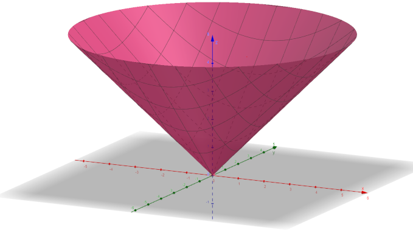
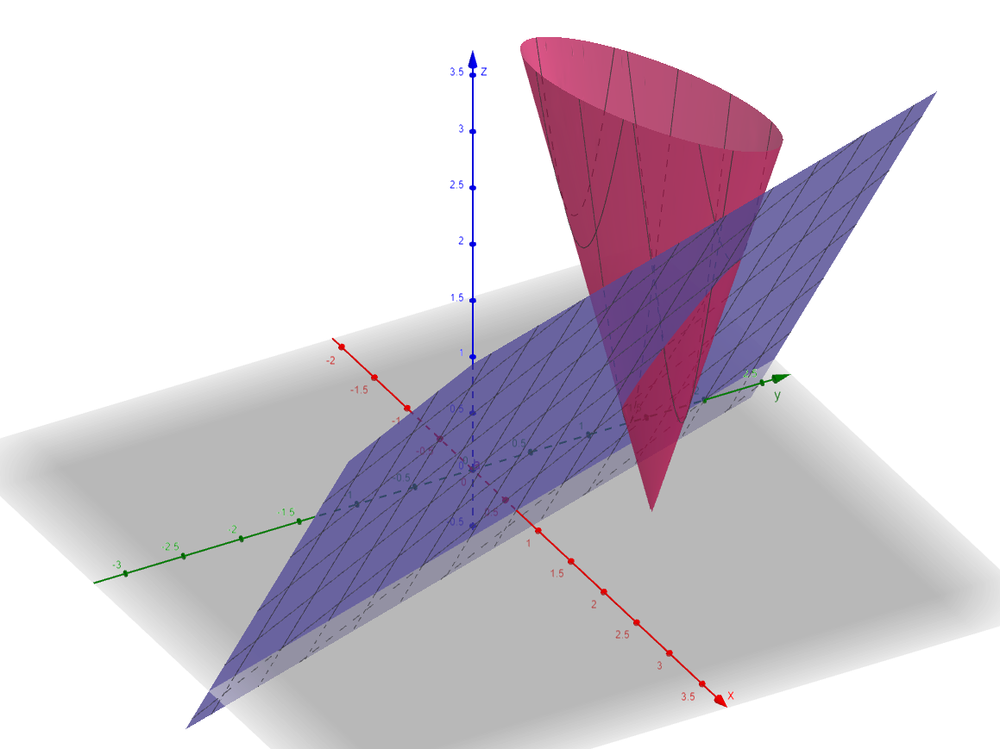
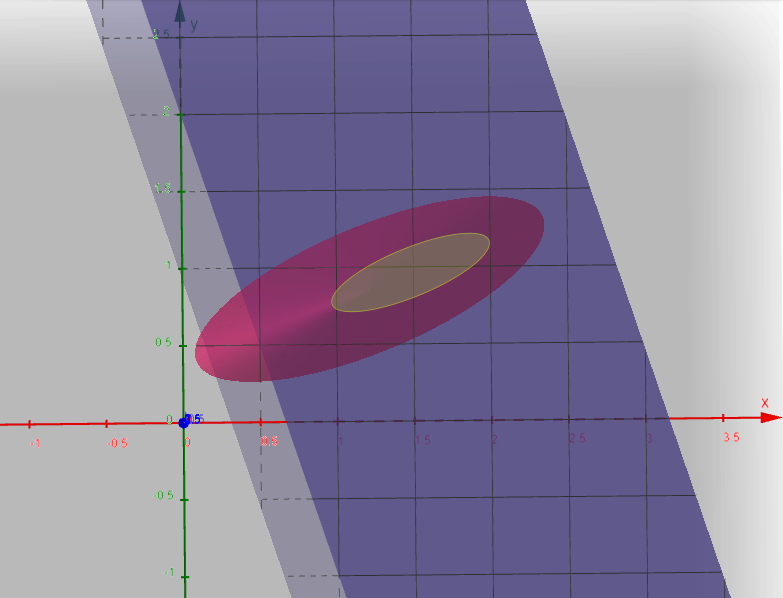

# 2. Tétel

Konvex optimalizálás, kúp problémák kezelése (lineáris programozás, másodrendű kúpprogramozás, szemidefinit programozás és általánosításai)

---

## Konvex optimalizálás

Egy optimalizálási feladatot (minimumfeladatot) akkor nevezünk konvexnek, ha 

1. A minimlizálandó költségfüggvény konvex

```math
\min f(\mathbf{x}), \quad f(\alpha\mathbf{x}_1 + (1-\alpha) \mathbf{x}_2) \leq \alpha f(\mathbf{x}_1) + (1-\alpha) f(\mathbf{x}_2), \quad \forall \alpha \in [0,1], \;\forall \mathbf{x}_1, \mathbf{x}_2 
```

2. Az egyenlőtlenség típusú korlátozásokat definiáló függvények konvexek 

3. Az egyenlőség típusú korlátozásokat definiáló függvények affin függvények (affin: lineáris egy konstanstól eltekintve).

A harmadik feltétel a másodikból következik, ha az egyenlőség típusú korlátozásokat két-két egyenlőtlenség típusúval helyettesítjük:
```math
g_i(\mathbf{x}) = 0 \iff g_i(\mathbf{x}) \leq 0 \text{ és } -g_i(\mathbf{x}) \leq 0
```
Az egyetlen konvex függvénytípus, aminek a $`-1`$-szerese is konvex, az affin függvény. 

A 2. és a 3. feltétel úgy is megfogalmazható, hogy a megengedhetőségi tartomány konvex.


### Lineáris programozás

A konvex optimalizálás speciális esete a lineáris programozás, amikor a mind a célfüggvény, mind a korlátozásokat definiáló függvények lineárisak (ill. affin függvények).

- Feladat:
```math
\min_{\mathbf{x}} \mathbf{c}^T\mathbf{x} = \min \sum_{i=1}^{n} c_i x_i
```

- Korlátozások:
```math
\mathbf{Ax} \leq \mathbf{b} \geq \mathbf{0}, \quad \mathbf{b}=[b_1,\dots,b_m]^T
```
```math
\mathbf{x} \geq \mathbf{0}
```

Ekkor a megengedhetőségi tartomány egy poliéder (hipersíkokkal határolt térrész), az optimumpont pedig a lineáris célfüggvény miatt ennek az egyik csúcspontja.

A feladat megoldására egy lehetőség a szimplex módszer, amikor a megengedhetőségi tartomány élei mentén mozgunk úgy, hogy mindig a legnagyobb mértékű csökkenést érjük el a célfüggvényben. Ehhez plusz változók bevezetésével (slack variables) egyenlőség típusúvá alakítjuk az egyenlőtlenség típusú korlátozásokat:

```math
\mathbf{Ax} + \mathbf{s} = \mathbf{b} \geq \mathbf{0}
```
```math
\mathbf{x} \geq \mathbf{0}, \; \mathbf{s} \geq \mathbf{0}
```

Az eljárás során az $`\mathbf{x}=\mathbf{0}`$ pontból indulunk, és a cél minden lépésben az, hogy az aktuális csúcspontból egy él mentén egy másik csúcspontba jussunk. Ehhez valamelyik aktuálisan aktív korlátozást (tight constraint, azaz amelynél az egyenlőség teljesül) lazítjuk (loosen), és egy másikat aktiválunk (tighten). Egy lépésben a következőket tesszük:
- A célfüggvényt vizsgálva azt az éppen nulla értékű (tight) változót választjuk ki, amelynek pozitív irányában a célfüggvény gradiense negatív és a legmeredekebb (ezt a változót fogjuk lazítani, azaz nullából elmozdítani).
- A korlátozások közül azt választjuk ki, amelynek határa a kiválasztott változó értékének növelése esetén a leghamarabb elérhető. 
- Ahhoz, hogy a kiválasztott korlátozást aktiváljuk (az egyenlőséget teljesítsük), a hozzá tartozó nem nulla (loose) változót nullává kell tennünk (tighten). A lazított (eddig nulla értékű) változót kifejezzük az aktiválandó korlátozás egyenletéből, és behelyettesítjük a többi korlátozásba és a célfüggvénybe. A lépés után, ha az új "szoros" változók helyére nullát helyettesítünk, megkapjuk a célfüggvény, ill. a korlátozás függvények aktuális értékét.

A folyamat során mind a célfüggvény, mind a korlátozások alakja változik, de mindig legalább $`n`$ db változónak nulla lesz az értéke az $`n+m`$ db összes változó közül. A célfüggvény mindig $`n`$ db változót fog tartalmazni (ezek kikerülhetnek $`\mathbf{x}`$ és $`\mathbf{s}`$ elemei közül is) ezek az aktuálisan nulla értékű (tight) változók lesznek, és az első lépés után a célfüggvényben lesz egy konstans tag is, ami a célfüggvény adott lépésben elért értékének felel meg. A folyamat akkor fejeződik be, ha a célfüggvényben egyik változónak sem negatív az együtthatója, vagyis egyik változó növelésével sem érhető el már kisebb függvényérték.

A lineáris programozási problémához mindig tartozik egy duális probléma is, amely az eredeti minimum alulról való korlátozásából vezethető le:
- Az $`\mathbf{Ax} \leq \mathbf{b}`$ alakú korlátozás minden sorát megszorozzuk egy-egy nempozitív $`y_j`$ változóval, és adjuk össze a sorokat: $`\mathbf{y}^T\mathbf{Ax} \geq \mathbf{y}^T\mathbf{b}, \; \mathbf{y}\leq 0`$ 
- Az $`y_j`$ változók értékét úgy válasszuk meg, hogy az eredmény a $`\mathbf{c}^T\mathbf{x}`$ célfüggvény minimumát alulról korlátozza a megengedhetőségi tartományban: $`\mathbf{c}^T\mathbf{x}^* \geq \mathbf{y}^T\mathbf{Ax}^* \geq \mathbf{y}^T\mathbf{b}`$
- Keressük az alsó korlát legnagyobb értékét úgy, hogy az egyenlőtlenség igaz maradjon:
  - $`\max_{\mathbf{y}} \mathbf{y}^T\mathbf{b}`$
  - $`\mathbf{y}^T\mathbf{Ax}^* \leq \mathbf{c}^T\mathbf{x}^*`$
- Transzponálás és egyszerűsítés után az alábbi duális LP problémát kapjuk:
```math
\max_{\mathbf{y}} \mathbf{b}^T\mathbf{y}
```
```math
\mathbf{A}^T\mathbf{y} \leq \mathbf{c}
```
```math
\mathbf{y}\leq \mathbf{0}
```

Fontos észrevenni, hogy az eredeti problémának akkor van $`\mathbf{x}=\mathbf{0}`$-tól különböző megoldása, ha $`\mathbf{c}`$ negatív. Emiatt a duális probléma megengedhetőségi tartománya minden $`y_j`$ változóban negatív (és bár konvex, de nem korlátos tartomány, az origótól távolodva "nyitott"). Bevezetve a $`\mathbf{z}=-\mathbf{y}`$ helyettesítést, a megengedhetőségi tartomány az eredetihez hasonló alakú lesz:

```math
\max_{\mathbf{y}} -\mathbf{b}^T\mathbf{z}
```
```math
\mathbf{A}^T\mathbf{z} \geq -\mathbf{c}
```
```math
\mathbf{z} \geq \mathbf{0}
```

\(Érdekes inspirációs videó: https://youtu.be/E72DWgKP_1Y?si=pK3geSNQbk8OOAxb\)


### Másodrendű kúpprogramozás

A másodrendű kúp program (second-order cone program, SOCP) egy konvex optimalizálási probléma, amely a következő alakban adható meg:
- $`\min_\mathbf{x} \mathbf{f}^T \mathbf{x}`$ (lineáris célfüggvény)
- Korlátozások:
  - $`|| \mathbf{A}_i \mathbf{x} + \mathbf{b}_i ||_2 \leq \mathbf{c}_i^T \mathbf{x} + d_i, \quad i=1,\dots,m`$
  - $`\mathbf{Fx} = \mathbf{g}`$

Az egyenlőtlenség típusú korlátozásokat teljesítő $`\mathbf{x}`$ pontok halmaza olyan halmaz, amelyre a következő affin transzformációt alkalmazva a transzformált pontok az $`n_i+1`$ dimenziós másodrendű kúp elemei (az $`\mathbf{A}_i`$ mátrix nem feltétlenül kvadratikus, hanem $`n_i \times n`$ típusú):
```math
\begin{bmatrix} \mathbf{A}_i \\ \mathbf{c}_i^T \end{bmatrix} \mathbf{x} + \begin{bmatrix} \mathbf{b}_i \\ d_i \end{bmatrix} \in C_{n_i+1}
```
ahol 
```math
C_{n_i+1}=\left\{ \begin{bmatrix} \mathbf{y} \\ t \end{bmatrix} \biggl| \; ||\mathbf{y}||_2 \leq t, \;\mathbf{y} \in \mathbb{R}^{n_i}, \; t \in \mathbb{R} \right\}  
```

Például a háromdimenziós másodrendű kúp alakja a következő:
```math
C_3=\left\{ \begin{bmatrix} x \\ y \\z \end{bmatrix} \biggl| \; \sqrt{x^2+y^2} \leq z \right\}  
```

Ez a halmaz az alábbi ábrán látható kúpfelület fölötti pontok halmaza:

<p align="center"></p>

Példa egy kétdimenziós esetre (legyen $`n=n_i=2`$):

$`\mathbf{A} = \begin{bmatrix} a_{11} & a_{12} \\ a_{21} & a_{22} \end{bmatrix}, \quad \mathbf{b} = \begin{bmatrix} b_1 \\ b_2\end{bmatrix} \quad \mathbf{c}^T = \begin{bmatrix} c_1 & c_2\end{bmatrix}`$  

$`\mathbf{A} \mathbf{x} + \mathbf{b} = \begin{bmatrix} a_{11}x_1+a_{12}x_2+b_1 \\ a_{21}x_1+a_{22}x_2+b_2 \end{bmatrix}`$  

$`||\mathbf{A} \mathbf{x} + \mathbf{b}||_2 = \sqrt{(a_{11}x_1+a_{12}x_2+b_1)^2 + (a_{21}x_1+a_{22}x_2+b_2)^2}`$

Az egyenlőtlenség típusú korlátozás ekkor:  

$`\sqrt{(a_{11}x_1+a_{12}x_2+b_1)^2 + (a_{21}x_1+a_{22}x_2+b_2)^2} \leq c_1 x_1 + c_2 x_2 + d`$

Legyen

$`\mathbf{A} = \begin{bmatrix} 4 & -8 \\ 2 & 3 \end{bmatrix}, \quad \mathbf{b} = \begin{bmatrix} 2 \\ -5 \end{bmatrix} \quad \mathbf{c}^T = \begin{bmatrix} 1.5 & 0.5 \end{bmatrix}, \quad d=-1,`$  

ekkor a korlátozás alakja:

$`\sqrt{(4 x_1 - 8 x_2 + 2)^2 + (2 x_1 + 3 x_2 - 5)^2} \leq 1.5 x_1 + 0.5 x_2 -1,`$

amely azoknak az $`(x_1, x_2)`$ pontoknak a halmazát jelenti, amelyekre a  $`z=\sqrt{(4 x_1 - 8 x_2 + 2)^2 + (2 x_1 + 3 x_2 - 5)^2}`$ egyenlettel megadott kúpfelület a $`z=1.5 x_1 + 0.5 x_2 -1`$ egyenletű sík alatt van (ld. alábbi bal oldali ábra). Ez a jobb oldali ábrán sárgával kiemelt ellipszis belső pontjait jelenti. 

<p align="center">
  
  
</p>


### Szemidefinit programozás

A szemidefinit program egy olyan optimalizálási probléma, ahol az optimalizálandó változók egy szimetrikus $`\mathbf{X}`$ mátrix elemei. A feladat a következő formában van megadva:

```math
\min_{\mathbf{X}\in \mathbb{S}^n} \text{trace}(\mathbf{CX}),
```
```math
\text{trace}(\mathbf{A}_i\mathbf{X}) \leq b_i, \quad i=1,\dots,m
```
```math
\mathbf{X} \succcurlyeq 0
```

A második korlátozás jelentése, hogy $`\mathbf{X}`$ pozitív szemidefinit. Az $`\mathbf{A}`$ és $`\mathbf{C}`$ mátrixok is szimmetrikusak ($`\mathbf{A}, \mathbf{C} \in \mathbb{S}^n`$). 

A célfüggvény és az első egyenlőtlenség típusú korlátozás $`\mathbf{X}`$ elemeiben lineáris, az $`\mathbf{X} \succcurlyeq 0`$ korlátozás pedig konvex, mivel a szimmetrikus pozitív szemidefinit mátrixok halmaza (az ún. pozitív szemidefinit kúp) konvex halmaz.

Megfelelő további változók bevezetésével ($`\mathbf{X}`$ diagonális kibővítésével) az egyenlőtlenség típusú korlátozás egyenlőség típusúvá alakítható, ekkor a probléma alakja:

```math
\min_{\mathbf{X}  \in \mathbb{S}^n} \text{trace}(\mathbf{CX}),
```
```math
\text{trace}(\mathbf{A}_i\mathbf{X}) = b_i, \quad i=1,\dots,m
```
```math
\mathbf{X} \succcurlyeq 0
```

A fenti problémának létezik a duálisa is:

```math
\max_{\mathbf{y}\in \mathbb{R}^m} \mathbf{b}^T\mathbf{y}, \quad \mathbf{b} = [b_1, \dots, b_m]^T
```
```math
\sum_{i=1}^m y_i \mathbf{A}_i - \mathbf{C} \preccurlyeq 0
```

A korlátozás egy lineáris mátrixegyenlőtlenség (LMI), amelynek általános alakja:

```math
\mathbf{A}_0 + \sum_{i=1}^m y_i \mathbf{A}_i \preccurlyeq 0
```

A másodrendű kúpprogramozás a szemidefinit programozás speciális esete, mivel a másodrendű kúp korlátozás megfogalmazható lineáris mátrixegyenlőtlenség formájában is. A másodrendű kúp pontjainak halmaza megfeleltethető a szimmetrikus pozitív szemidefinit mátrixok egy részhalmazának, ugyanis

$`||\mathbf{y}||_2 \leq t \iff \begin{bmatrix} t\mathbf{I} & \mathbf{y} \\ \mathbf{y}^T & t \end{bmatrix} \succcurlyeq 0`$

A másodrendű kúp korlátozás ez alapján felírható LMI-ként is:

$`|| \mathbf{A}_i \mathbf{x} + \mathbf{b}_i ||_2 \leq \mathbf{c}_i^T \mathbf{x} + d_i \iff \begin{bmatrix} (\mathbf{c}_i^T \mathbf{x} + d_i)\mathbf{I} & \mathbf{\mathbf{A}_i \mathbf{x} + \mathbf{b}_i} \\ \mathbf{\mathbf{A}_i \mathbf{x} + \mathbf{b}_i}^T & \mathbf{c}_i^T \mathbf{x} + d_i \end{bmatrix} \succcurlyeq 0`$
