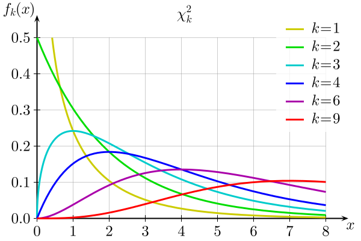
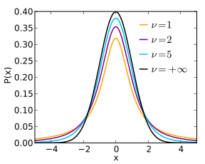
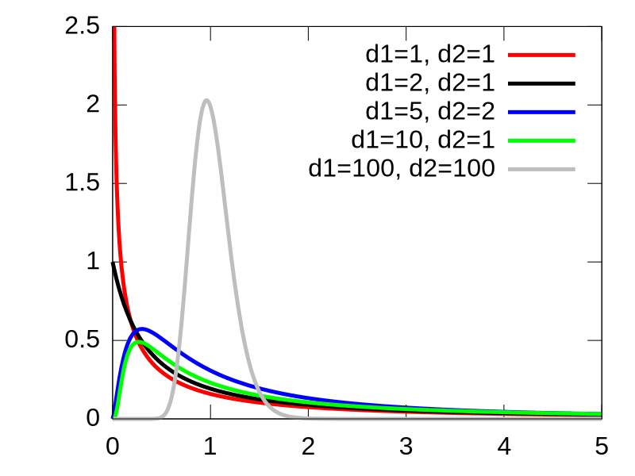

# Valószínűségszámítás alapfogalmak

## Valószínűség fogalma

Valószínűségi tér: $`(\Omega,\mathcal{A},P)`$, ahol
- $\Omega$: elemi események halmaza
- $\mathcal{A}$: Összetett események halmaza, pl. $A \in \mathcal{A}$
- $P$: összetett eseményekhez rendelt mérték, a valószínűség

Fogalmak:
- $P(A)$: az $A$ esemény valószínűsége
- $P(A \cap B )$ vagy $P(AB)$: $A$ és $B$ esemény együttes valószínűsége (annak valószínűsége, hogy $A$ és $B$) is bekövetkezik
- $P(A \cup B )$ vagy $P(A+B)$: annak valószínűsége, hogy $A$ vagy $B$ esemény bekövetkezik
- $P(B|A)$: Feltételes valószínűség. Annak valószínűsége, hogy $B$ bekövetkezik, feltéve, hogy $A$ is bekövetkezik

Tulajdonságok:

- $0 \leq P(A) \leq 1$
- $P(\Omega)=1$
- $P(A + B) = P(A) + P(B) - P(AB)$
- $P(AB) = P(B|A) \cdot P(A)$, vagy átrendezve:
- $P(B|A) = \dfrac{P(AB)}{P(A)}$

## Valószínűségi változó fogalma

A $\xi(\omega)$ valószínűségi változó egy olyan függvény, amely az $\omega \in \Omega$ elemi eseményekhez valós számokat rendel:

$$ \xi: \Omega \rightarrow \Xi \subseteq \mathbb{R}$$

Az $\mathcal{A}$ eseménytér a következőképpen definiált összetett $`A_x`$ események halmaza:

```math
A_x = \left\{ \omega \; | \; \xi(\omega) \leq x, \; x \in \Xi \right\}
```
A $\xi$ valószínűségi változó $`F_\xi (x)`$ __eloszlásfüggvénye__ az $`A_x`$ esemény valószínűségét adja meg $x$ függvényében:

```math
F_\xi (x) = P(A_x) = P(\xi \leq x)
```

A $\xi$ valószínűségi változó $`f_\xi (x)`$ __sűrűségfüggvénye__ az $`F_\xi (x)`$ eloszlás függvény $x$ szerinti deriváltja:

```math
f_\xi (x) = \frac{d F_\xi (x)}{dx}
```
```math
F_\xi (x) = \int_{-\infty}^x f_\xi (u) du
```

Annak a valószínűsége, hogy $a \leq \xi \leq b$, az eloszlásfüggvény segítségével kifejezhető:

```math
P(a \leq \xi \leq b) = F_\xi(b) - F_\xi(a) = \int_{a}^{b} f_\xi (x) dx
```


A $\xi$ valószínűségi változó __várható értéke__:

```math
E(\xi) = \int _{-\infty}^{\infty} x f_\xi(x) dx = \mu_\xi
```

A $\xi$ valószínűségi változó __varianciája__ vagy szórásnégyzete a várható értéktől való négyzetes eltérés várható értéke:

```math
D^2(\xi) = \sigma^2_\xi = E \left( (\xi - E(\xi))^2 \right) = E \left( (\xi - \mu_\xi)^2 \right) =  E(\xi^2) -\mu^2_\xi
```
```math
\sigma^2_\xi = \int _{-\infty}^{\infty} (x-\mu_\xi)^2 f_\xi(x) \ dx
```

### Valószínűségi vektorváltozók

Az $n$-dimenziós $`\vec{\xi} = \left[ \xi_1,\dots,\xi_n\right]^T`$ vektorváltozón olyan valós elemű vektort értünk, amelynek minden eleme valószínűségi változó. Ennek eloszlásfüggvénye, vagyis a $`\xi_1,\dots,\xi_n`$ valószínűségi változók __együttes eloszlásfüggvénye__ a következő $n$-változós függvény:

```math
F(x_1,\dots,x_n) = P(\xi_1 \leq x_1,\dots,\xi_n \leq x_n)
```

Sűrűségfüggvénye (a $`\xi_1,\dots,\xi_n`$ valószínűségi változók __együttes sűrűségfüggvénye__) pedig a következő:

```math
f(x_1,\dots,x_n) = \frac{\partial^n F(x_1,\dots,x_n)}{\partial x_1 \dots \partial x_n}
```
```math
F(x_1,\dots,x_n) = \int_{-\infty}^{x_1} \dots \int_{-\infty}^{x_n} f (u_1,\dots,u_n) \ du_1 \dots du_n
```

Az egyszerűség kedvéért tekintsük egy kétdimenziós $[\xi,\eta]^T$ valószínűségi vektorváltozót, amelynek eloszlásfüggvénye $F_{\xi,\eta}(x,y)$  és sűrűségfüggvénye $f_{\xi,\eta}(x,y)$. Ekkor a $\xi$-nek az $`\eta = y`$ feltételre vonatkozó __feltételes eloszlásfüggvényén__ a következőt értjük:

```math
 F_{\xi|\eta}(x | y) = P(\xi \leq x \ | \ \eta=y) = \int_{-\infty}^x f_{\xi|\eta}(u | y) \ du
```
ahol $`f_{\xi|\eta}(x | y)`$ a $\xi$-nek az $`\eta = y`$ feltételre vonatkozó __feltételes sűrűségfüggvénye__.


Ennek speciális esete a $`-\infty < \eta < \infty`$ feltétel melletti feltételes eloszlásfüggvény (vagyis $\eta$ értéke bármi lehet), ami a $[\xi,\eta]^T$ valószínűségi vektorváltozó $\xi$-re vonatkozó __peremeloszlásfüggvénye__:

```math
 F_{\xi|\eta}(x \ | -\infty < \eta < \infty) = F_{\xi}(x) = P(\xi \leq x) = \int_{-\infty}^x \int_{-\infty}^{\infty} f_{\xi,\eta}(u,v) \ du \ dv = \int_{-\infty}^x f_\xi(u) \ du
```

ahol $f_\xi(x)$ a $[\xi,\eta]^T$ valószínűségi vektorváltozó $\xi$-re vonatkozó __peremsűrűségfüggvénye__:

```math
f_\xi(x) = \int_{-\infty}^{\infty} f_{\xi,\eta}(x,y) \ dy
```

Más szóval $[\xi,\eta]^T$ valószínűségi vektorváltozó $\xi$-re vonatkozó peremeloszlásfüggvénye és  peremsűrűségfüggvénye nem más, mint a $\xi$ valószínűségi változó eloszlásfüggvénye és sűrűségfüggvénye $\eta$ figyelembe vétele nélkül. Ugyanígy definiálható a valószínűségi vektorváltozó $\eta$-ra vonatkozó peremsűrűségfüggvénye is:

```math
f_\eta(y) = \int_{-\infty}^{\infty} f_{\xi,\eta}(x,y) \ dx
```

Igaz továbbá a következő összefüggés:
```math
f_{\xi|\eta} (x|y)\cdot f_\eta(y)= f_{\xi,\eta}(x,y) = f_{\eta|\xi}(y|x) \cdot f_\xi(x)
```


A feltételes eloszlás és peremeloszlás fogalma $n$-dimenziós vektorváltozó esetére is könnyen általánosítható.


### Kovariancia, korreláció és függetlenség

Két valószínűségi változó __kovarianciája__, amely a két változó közötti lineáris összefüggést (a két változó együttmozgását) mutatja:

```math
\text{Cov}(\xi,\eta) = E \Bigl( \bigl( \xi - E(\xi) \bigr) \bigl( \eta - E(\eta) \bigr) \Bigr) = E \bigl( ( \xi - \mu_\xi ) ( \eta - \mu_\eta ) \bigr)
```
```math
= E ( \xi\eta - \xi \mu_\eta - \eta \mu_\xi + \mu_\xi \mu_\eta) = E(\xi\eta) - \mu_\xi \mu_\eta - \mu_\eta \mu_\xi + \mu_\xi \mu_\eta
```
```math
= E(\xi\eta) - \mu_\xi \mu_\eta = E(\xi \eta) - E(\xi)E(\eta)
```

```math
\text{Cov}(\xi,\eta) = \int_{-\infty}^{\infty} \int_{-\infty}^{\infty} (x-\mu_\xi)(y-\mu_\eta) \ f(x,y) \ dx \ dy
```

```math
= \int_{-\infty}^{\infty} \int_{-\infty}^{\infty} xy \ f(x,y) \ dx \ dy - \mu_\xi \mu_\eta
```

Ebből látszik, hogy egy valószínűségi változó varianciája megegyezik önmagával vett kovarianciájával:

```math
\text{Cov}(\xi,\xi) = E(\xi^2)-E^2(\xi) = \sigma^2_\xi
```

Az $[\xi,\eta]^T$ valószínűségi vektorváltozó __kovarianciamátrixa__ a következő szimmetrikus, pozitív szemidefinit mátrix:

```math
\mathbf{C} = \begin{bmatrix} \sigma^2_\xi & \text{Cov}(\xi,\eta) \\ \text{Cov}(\xi,\eta) & \sigma^2_\eta\end{bmatrix}
```

Az $n$-dimenziós $`\vec{\xi} = \left[ \xi_1,\dots,\xi_n\right]^T`$ vektorváltozó kovarianciamátrixa $n \times n$ méretű:

```math
\mathbf{C} = 
\begin{bmatrix} 
\sigma^2_1 & c_{1,2} & \cdots & c_{1,n} \\ 
c_{1,2} & \sigma^2_2 & \cdots & c_{2,n} \\
\vdots & \vdots & \ddots & \vdots \\
c_{1,n} & c_{2,n} & \cdots & \sigma^2_n 
\end{bmatrix}
```
ahol $`c_{i,j} = \text{Cov}(\xi_i,\xi_j)`$.

A $`\rho(\xi_i,\xi_j)`$ __korrelációs együttható__ két valószínűségi változó kovarianciájának a változók szórásával normált értéke:
```math
\rho(\xi_i,\xi_j) = \frac{\text{Cov}(\xi_i,\xi_j)}{\sigma_i \sigma_j}
```

Akkor mondjuk, hogy a $\xi$ és $\eta$ valószínűségi változók __függetlenek__, ha 
```math
P(\xi \leq x, \eta \leq y) = P(\xi \leq x) \cdot P(\eta \leq y)
```
Továbbá, két valószínűségi változó ($\xi$ és $\eta$) akkor és csak akkor független, ha 
```math
f_{\xi,\eta}(x,y) = f_\xi(x) \cdot f_\eta(y)
```

Ha két valószínűségi változó független, akkor kovarianciájuk zérus, más szóval korrelálatlanok (ez fordítva nem mindig igaz). Tehát a függetlenségből következik a korrelálatlanság:
```math
\text{Cov}(\xi,\eta) = \int_{-\infty}^{\infty} \int_{-\infty}^{\infty} xy \ f_{\xi,\eta}(x,y) \ dx \ dy - \mu_\xi \mu_\eta
```
```math
= \int_{-\infty}^{\infty} \int_{-\infty}^{\infty} xy \ f_\xi(x) f(y)_\eta \ dx \ dy - \mu_\xi \mu_\eta
```
```math
= \int_{-\infty}^{\infty}  x \ f_\xi(x) dx \int_{-\infty}^{\infty} y \ f_\eta(y) \ dy - \mu_\xi \mu_\eta
```
```math
= \mu_\xi \mu_\eta - \mu_\xi \mu_\eta = 0
```

### Karakterisztikus függvény

Egy $\xi$ valószínűségi változó karakterisztikus függvénye a következőképpen definiált komplex függvény:
```math
g_\xi(t) = E \left( e^{j\xi t} \right) = \int_{-\infty}^{\infty} e^{j x t} f_\xi(x) \ dx
```
ahol $j$ a képzetes egységet jelenti. Vektorváltozó esetén:
```math
g_{\vec{\xi}}(\mathbf{t}) = E \biggl( \text{exp}\!\left({j \mathbf{t}^T \vec{\xi}} \right) \biggr) = \int_{-\infty}^{\infty} \dots \int_{-\infty}^{\infty} \text{exp}\!\left({j \mathbf{t}^T \mathbf{x}} \right) f_\xi(\mathbf{x}) \ dx_1 \dots dx_n
```


## A normális eloszlás

A $m$ várható értékű, $\sigma^2$ varianciájú normális eloszlás (másnéven Gauss-eloszlást) sűrűségfüggvénye a következő:
```math
\mathcal{N}(m,\sigma^2) \quad\longrightarrow \quad f(x) = \frac{1}{\sqrt{2 \pi} \sigma} e^{-\frac{(x-m)^2}{2 \sigma^2}}
```

Az $\mathcal{N}(0,1)$ standard normális eloszlás sűrűségfüggvénye:
```math
\mathcal{N}(0,1) \quad\longrightarrow \quad f(x) = \frac{1}{\sqrt{2 \pi}} e^{-\frac{x^2}{2}}
```

Az $n$-dimenziós normális eloszlás sűrűségfüggvénye, amelynek várható értéke $\mathbf{m}$, kovarianciamátrixa $\mathbf{C}$:
```math
\mathcal{N}(\mathbf{m},\mathbf{C}) \quad\longrightarrow \quad f(\mathbf{x}) = \frac{1}{\left( \sqrt{2 \pi} \right)^n \sqrt{\text{det}\mathbf{C}}} \ \text{exp} \left(-\frac{1}{2} \left( \mathbf{x} - \mathbf{m} \right)^T \mathbf{C}^{-1} \left( \mathbf{x} - \mathbf{m} \right) \right)
```

Az egydimenziós és az $n$-dimenziós normális eloszlás karakterisztikus függvénye:

```math
\mathcal{N}(m,\sigma^2) \quad\longrightarrow \quad g(t) = \text{exp} \left( jtm - \frac{1}{2} \sigma^2t^2 \right)
```
```math
\mathcal{N}(\mathbf{m},\mathbf{C}) \quad\longrightarrow \quad g(\mathbf{t}) = \text{exp} \left( j \mathbf{t}^T \mathbf{m} - \frac{1}{2} \mathbf{t}^T \mathbf{C} \mathbf{t} \right)
```

### A normális eloszlás tulajdonságai

#### 1. Függetlenség és korrelálatlanság kapcsolata

A normális eloszlás esetén a korrelálatlanságból következik a függetlenség (általános esetben a következtetés csak a másik irányban igaz). Tekintsük például a következő kétdimenziós korrelálatlan normális eloszlást:
```math
\begin{bmatrix} \xi \\ \eta \end{bmatrix} \sim \mathcal{N} 
\left( 
    \begin{bmatrix} m_\xi \\ m_\eta \end{bmatrix},  
    \begin{bmatrix} \sigma^2_\xi & 0 \\ 0 & \sigma^2_\eta \end{bmatrix}
\right)
```
Ennek sűrűségfüggvénye:

```math
f(x,y) = \frac{1}{\left( \sqrt{2 \pi} \right)^2 \sqrt{\text{det}\mathbf{C}}} \ \text{exp} \left( -\frac{1}{2} 
\begin{bmatrix} x-m_\xi \\ y-m_\eta \end{bmatrix}^T 
\begin{bmatrix} \sigma^2_\xi & 0 \\ 0 & \sigma^2_\eta \end{bmatrix}^{-1} 
\begin{bmatrix} x-m_\xi \\ y-m_\eta \end{bmatrix}
\right)
```
```math
= \frac{1}{\left( \sqrt{2 \pi} \right)^2 \sigma_\xi \sigma_\eta} \ \text{exp} \left( -\frac{1}{2} ( x-m_\xi)^2 \sigma^2_\xi -\frac{1}{2} (y-m_\eta)^2 \sigma^2_\eta
\right)
```
```math
= \frac{1}{ \sqrt{2 \pi} \sigma_\xi } \ \text{exp} \left( -\frac{1}{2} ( x-m_\xi)^2 \sigma^2_\xi 
\right) 
\cdot
\frac{1}{ \sqrt{2 \pi} \sigma_\eta } \ \text{exp} \left( -\frac{1}{2} (y-m_\eta)^2 \sigma^2_\eta
\right)
```
```math
= f(x) \cdot f(y)
```

#### 2. Lineáris transzformáció

Adott egy $`\xi \sim \mathcal{N}(\mathbf{m}_\xi, \mathbf{C}_\xi)`$ normális eloszlású vektorváltozó. Képezzük belőle a következő lineáris transzformáció segítségével az $\eta$ származtatott eloszlást:
```math
\eta = \mathbf{A} \xi + \mathbf{b}
``` 
Belátható, hogy $\eta$ is normális eloszlású lesz $`\mathbf{m}_\eta = \mathbf{A} \mathbf{m}_\xi + \mathbf{b}`$ várható értékkel és $`\mathbf{C}_\eta = \mathbf{A}\mathbf{C}_\eta\mathbf{A}^T`$ kovarianciamátrixszal:
```math
\eta \sim \mathcal{N} \left( \mathbf{A} \mathbf{m}_\xi + \mathbf{b}, \; \mathbf{A}\mathbf{C}_\eta\mathbf{A}^T \right)
```

Például két normális eloszlású skalár valószínűségi változó összege meghatározható a fenti alapján $\mathbf{A} = \begin{bmatrix} 1 & 1\end{bmatrix}$ és $\mathbf{b} = \begin{bmatrix} 0 & 0\end{bmatrix}^T$ helyettesítéssel:
```math
\begin{bmatrix} \xi_1 \\ \xi_2 \end{bmatrix} \sim \mathcal{N} 
\left( 
    \begin{bmatrix} m_1 \\ m_2 \end{bmatrix},  
    \begin{bmatrix} \sigma^2_1 & c_{1,2} \\ c_{1,2} & \sigma^2_2 \end{bmatrix}
\right)
```
```math
\eta = \xi_1 + \xi_2 = \begin{bmatrix} 1 & 1\end{bmatrix} \begin{bmatrix} \xi_1 \\ \xi_2 \end{bmatrix} + \begin{bmatrix} 0 \\ 0 \end{bmatrix}
```
```math
m_\eta = \begin{bmatrix} 1 & 1\end{bmatrix} \begin{bmatrix} m_1 \\ m_2 \end{bmatrix} + \begin{bmatrix} 0 \\ 0 \end{bmatrix} = m_1 + m_2
```
```math
\sigma^2_\eta = \begin{bmatrix} 1 & 1\end{bmatrix} \begin{bmatrix} \sigma^2_1 & c_{1,2} \\ c_{1,2} & \sigma^2_2 \end{bmatrix} \begin{bmatrix} 1 \\ 1 \end{bmatrix} = \sigma^2_1 + \sigma^2_2 + 2 c_{1,2}
```
```math
\eta = \xi_1 + \xi_2 \;\; \sim \;\; \mathcal{N} \Bigl( m_1 + m_2 , \;\; \sigma^2_1 + \sigma^2_2 + 2 c_{1,2} \Bigr)
```


#### 3. Feltételes sűrűségfüggvény

Legyen $\xi_1$ egy $n$-dimenziós, $\xi_2$ egy $m$-dimenziós normális eloszlású vektorváltozó. Ezeknek legyen az együttes eloszlása:

```math
\begin{bmatrix} \xi_1 \\ \xi_2 \end{bmatrix} \sim
\mathcal{N} \left( 
\begin{bmatrix} \mathbf{m}_1 \\ \mathbf{m}_2 \end{bmatrix},
\begin{bmatrix} \mathbf{C}_{11} & \mathbf{C}_{12} \\ \mathbf{C}_{21} & \mathbf{C}_{22}
\end{bmatrix}
\right), \quad \mathbf{C}_{12} = \mathbf{C}_{21}^T
```

Ekkor az $`f_{\xi_1 | \xi_2}( \mathbf{x}_1 | \mathbf{x}_2)`$ feltételes eloszlásfüggvény a következőképpen fejezhető ki:
```math
f_{\xi_1 | \xi_2}( \mathbf{x}_1 | \mathbf{x}_2) = \mathcal{N} \left( 
\mathbf{m_1} + \mathbf{C}_{12}\mathbf{C}_{22}^{-1} (\mathbf{x}_2 - \mathbf{m}_2), \;\;
\mathbf{C}_{11} - \mathbf{C}_{12}\mathbf{C}_{22}^{-1}\mathbf{C}_{21}
\right)
```


#### 4. Centrális határeloszlás tétele

A centrális határeloszlás tétele azt mondja ki, hogy $n$ darab azonos típusú (nem feltétlenül normális eloszlású) független valószínűségi változó átlaga normális eloszlást mutat, ha $n \rightarrow \infty$. Máshogy fogalmazva, ha ugyanabbból a valószínűségi eloszlásból $n$ db mintát veszünk, akkor a minták átlaga $n \rightarrow \infty$ esetén normális eloszlást mutat. 

Legyen $`\xi_1,\dots,\xi_n`$ független, azonos típusú valószínűségi változók sorozata, és legyen $`E(\xi_i)=\mu`$, $`D^2(\xi_i) = \sigma^2`$, $i=1,\dots,n$. Ekkor igaz a következő állítás:
```math
\sqrt{n} \left( \bar{\xi}-\mu \right) = \sqrt{n} \frac{\sum_{i=1}^{n} (\xi_i - \mu)}{n} = \frac{1}{\sqrt{n}} \left( \sum_{i=1}^{n} \xi_i - n \mu\right)
\;\; \xrightarrow{n \rightarrow\infty} \;\; \mathcal{N}\left( 0, \sigma^2 \right)
```


## Normális eloszlásból származtatott eloszlások

A normális eloszlásból nemlineáris transzformációval keletkező eloszlás nem normális eloszlás. Például a standard normális eloszlás négyzete nem normális eloszlású:
```math
\xi \sim \mathcal{N}(0,1) \;\; \longrightarrow \;\; \eta = \xi^2
```
```math
F_\eta(y) = P \left(\eta \leq y \right) = P \left(\xi^2 \leq y \right) = P \left( -\sqrt{y} \leq \xi \leq \sqrt{y} \right)
```
```math
= \int_{-\sqrt{y}}^{\sqrt{y}} \frac{1}{\sqrt{2 \pi}} e^{-\frac{1}{2}x^2} dx = 2 \int_{0}^{\sqrt{y}} \frac{1}{\sqrt{2 \pi}} e^{-\frac{1}{2}x^2} dx
```
```math
f_\eta(y) = \frac{1}{\sqrt{2 \pi y}} e^{-\frac{1}{2}y^2}, \quad y\geq 0
```

### $\chi^2$-eloszlás

Vegyünk $n$ darab standard normális eloszlású független valószínűségi változót, és képezzük a négyzetösszegüket. A kapott eloszlás a $\chi^2$-eloszlás:

```math
\chi^2(n) = \sum_{i=1}^n \xi_i^2, \quad \text{ahol} \; \xi_1,\dots,\xi_n \sim \mathcal{N}(0,1) \text{ és független}
```
Az $n$ értéke a $\chi^2$ eloszlás szabadságfoka. A $\chi^2$-eloszlás várható értéke és varianciája a következő:

```math
E(\chi^2(n)) = n
```
```math
D^2(\chi^2(n)) = 2n
```

A $\chi^2$-eloszlás sűrűségfüggvénye növekvő $n$ értékekre (az ábrán $k$-val jelölve):

<p align="center">
  
</p>

(Forrás: https://en.wikipedia.org/wiki/Chi-squared_distribution)


### Student-féle t-eloszlás

$n+1$ db standard normális eloszlású valószínűségi változóból a következőképpen származtatható a Student-eloszlás vagy másnéven t-eloszlás:

```math
t(n) = \frac{\eta}{\sqrt{\frac{1}{n}\sum_{i=1}^n \xi_i^2}}, \quad \text{ahol} \; \xi_1,\dots,\xi_n,\eta \sim \mathcal{N}(0,1) \text{ és független}
```
Az $n$ értéke a t-eloszlás szabadságfoka. A t-eloszlás várható értéke és varianciája a következő:

```math
E(t(n)) = 0
```
```math
D^2(t(n)) = \frac{n}{n-2}
```
<p align="center">
  
</p>

(Forrás: https://en.wikipedia.org/wiki/Student%27s_t-distribution)


### Fisher-eloszlás

$n+m$ db standard normális eloszlású valószínűségi változóból a következőképpen származtatható a Fisher-eloszlás:

```math
F(m,n) = \frac{\frac{1}{m}\sum_{j=1}^m \eta_j^2}{\frac{1}{n}\sum_{i=1}^n \xi_i^2}, \quad \text{ahol} \; \xi_1,\dots,\xi_n,\eta_1,\dots,\eta_m \sim \mathcal{N}(0,1) \text{ és független}
```
A Fisher-eloszlás várható értéke a következő:

```math
E(F(m,n)) = \frac{n}{n-2}
```

<p align="center">
  
</p>

(Forrás: https://en.wikipedia.org/wiki/F-distribution)

